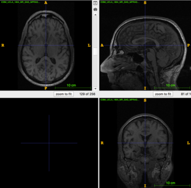

## DeepDefacer: Automatic Removal of Facial Features via Deep Learning.
 
 <div align="center">
 -------->  
</div>

DeepDefacer is a MRI anonymization tool written in Python, on top of Tensorflow and Keras, that was developed in partnership with the Poldrack Lab at Stanford University. It can be used to quickly deface 3D MRI images of any resolution and size on commercial CPUs and GPUs. Its goal is to provide the community with an easy to use and efficient tool for defacing medical images that require anonymization for compliance with federal privacy laws (e.g HIPAA). 

### Referencing and citing DeepDefacer
If you use DeepDefacer in your work, please refer to this citation for the current version:

```
@article{khazane2019state,
  title={DeepDefacer: Automatic Removal of Facial Features from MR Scans Via Deep Learning},
  author={Anish Khazane, Julien Hoachuck, Dr. Chris Gorgowelski, Dr. Russell Poldrack},
  journal={in proceedings, arXiv preprint},
  year={2019}
}
```
If you use any of the architecture code from the [ARFF-CNN](https://github.com/AKhazane/ARFF-CNN.git), please also use the citation above to comply with its authors' instructions on referencing.


### Requirements 

* Any Python version between 2.7 and 3.6.
* If you are using the GPU version of this library, please ensure that your GPU drivers are correctly installed and up to date. Please reference [GPU Support for Tensorflow-GPU](https://www.tensorflow.org/install/gpu) for further details on GPU setup. 
* Input MRI images must have 3D structure and be saved in either .nii or .nii.gz format.

### Installation

Deepdefacer can be easily installed on any operating system via Pypi. There are two versions of this package; CPU or GPU support. Please enter **one** of the following commands into your terminal window to begin installation, depending on your system specifications and desired python version. 

CPU Support
```
pip install deepdefacer[tf_cpu] / pip3 install deepdefacer[tf_cpu]
```

GPU Support
```
pip install deepdefacer[tf_gpu] / pip3 install deepdefacer[tf_gpu]
```

**Note: If you are using a ZSH-type shell, you may need to wrap the package name in quotations in order to successfully initiate the Pip installation. (e.g ```pip install "deepdefacer[...]"```).**

### Usage and Documentation

Once installed, please enter `deepdefacer --help` into your terminal window to see a list of available options for this program. Defacing a 3D MRI image is extremely simple, and can be done with the following command:

 ```deepdefacer --input_file <input filename> ```
 
 The program will output a defaced image in the same directory as the input file, unless `--defaced_output_path` is specified. 
 
 You can also save the predicted mask for any MRI image by specifying the desired output filename and directory with the `--mask_output_path` option. 

### Contributing to DeepDefacer

If you are interested in learning more about the model architecture that powers DeepDefacer, please view the files within [ARFF-CNN](https://github.com/AKhazane/ARFF-CNN.git). We welcome any contributions to this codebase (whether it be a more robust model, package options, etc). If you are particularly interested in modifying the model architecture, please reivew the following steps:

1. Clone [ARFF-CNN](https://github.com/AKhazane/ARFF-CNN.git)
2. Store data (MRI Images, volumetric or 2D in nature) within a directory named `data` in the same directory as ARFF-CNN. 
3. Execute `python train.py` and the model will begin training for a single epoch. The model weights and graph will be stored in a `hdf5` file in the same directory as ARFF-CNN.

**Please note that ARFF-CNN is not fully integrated with a robust argparser command-line utility tool. This package is currently being updated to support more command-line arguments for easier usage**.
