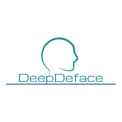

## DeepDeface: Automatic Removal of Facial Features via Deep Learning.

  

  

DeepDeface is a MRI anonymization tool written in Python, on top of Tensorflow and Keras, that was developed in partnership with the Poldrack Lab at Stanford University. It can be used to quickly deface MRI images of any resolution and size on commercial CPUs or GPUs. Its goal is to provide the community with an easy to use and efficient tool for defacing medical images that require anonymization for compliance with federal privacy laws (e.g HIPAA). 

